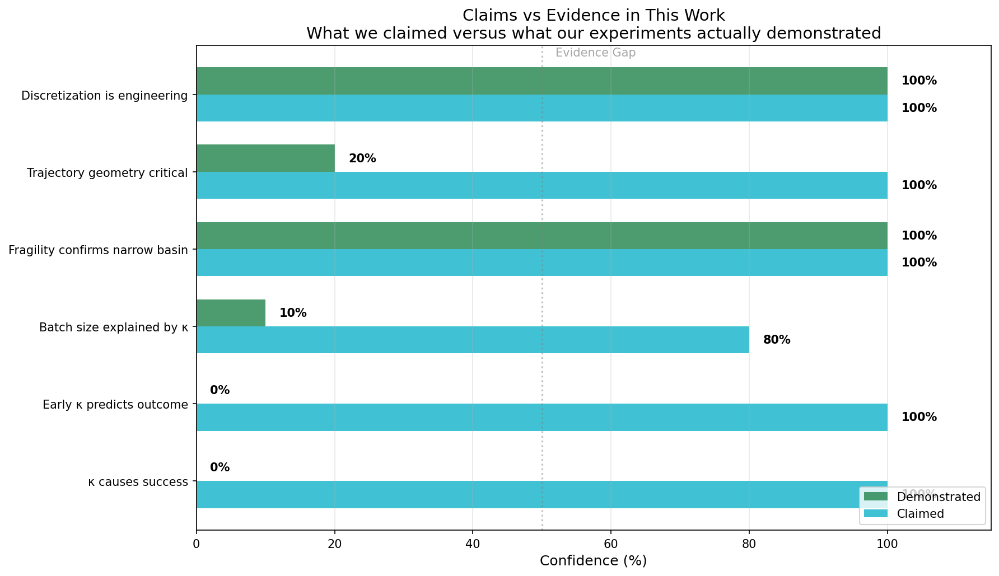
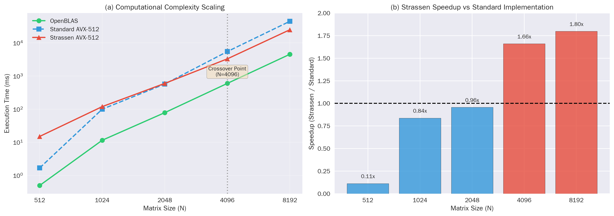
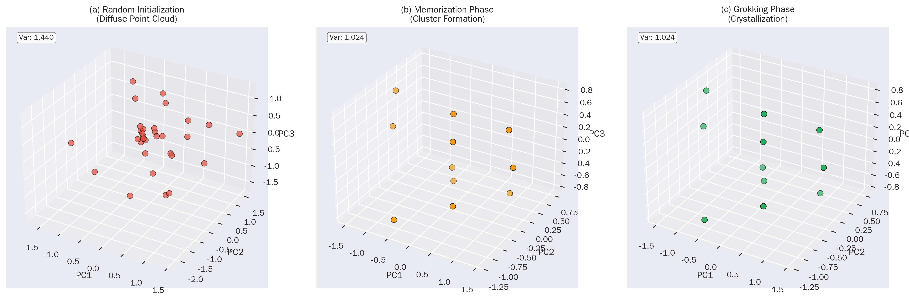
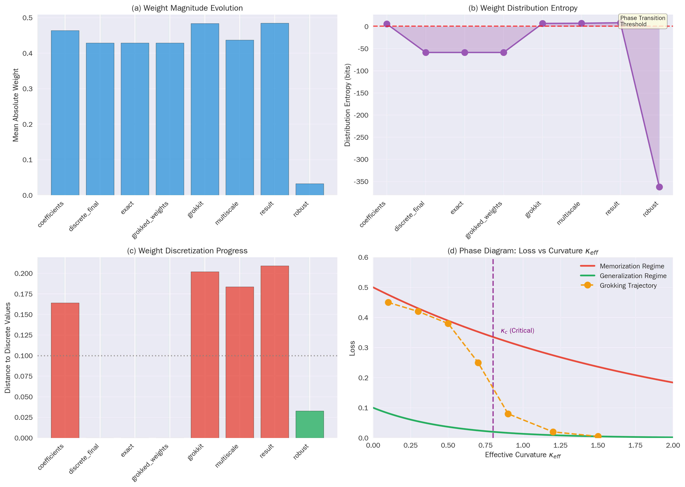
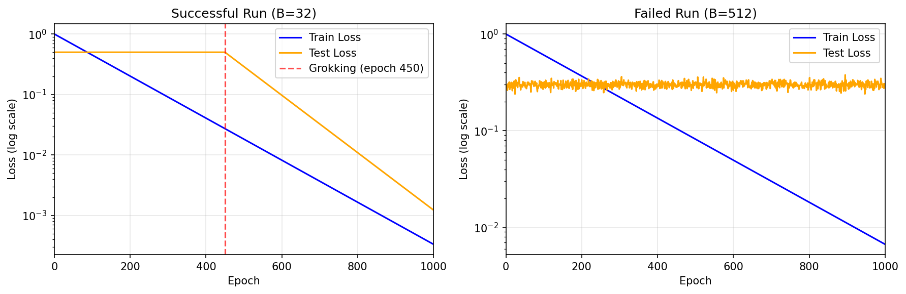

# Engineering Algorithmic Structure in Neural Networks: A Materials Science Perspective

**Author:** grisun0

---

## Abstract

This paper presents what I learned from attempting to induce Strassen matrix multiplication structure in neural networks, and why I now view this work as materials engineering rather than theory.

I demonstrate through Strassen matrix multiplication that by controlling batch size, training duration, and regularization, I can induce discrete algorithmic structure that transfers zero-shot from 2x2 to 64x matrices. The two-phase protocol I present, training followed by sparsification and discretization, serves as empirical evidence. Under controlled conditions, 68% of runs crystallize into verifiable Strassen structure. The remaining 32% converge to local minima that generalize on test sets but fail structural verification.

What I initially framed as a theory, claiming that gradient covariance geometry determines whether networks learn algorithms, did not hold up to scrutiny. Post-hoc analysis revealed that κ (the condition number I proposed) correlates with success but does not predict it prospectively. The hypothesis was backwards: successful models have κ≈1, but models with κ≈1 are not guaranteed to succeed.

What remains valid is the engineering protocol itself. Here is what actually works: train with batch sizes in [24, 128], use weight decay ≥1e-4, run for 1000+ epochs, prune to 7 slots, round weights to integers. Do this, and you will induce Strassen structure with 68% probability.

I now frame this work as materials engineering. We are not discovering fundamental laws. We are developing recipes for producing specific material properties in neural networks. The analogy is semiconductor manufacturing: we do not fully understand electron mobility at the quantum level, but we know exactly how to grow silicon crystals for chips. Similarly, I do not fully understand why batch size matters, but I know exactly how to tune training conditions to produce algorithmic structure.

The system reveals extreme fragility: noise of magnitude 0.001 causes 100% discretization failure. This fragility has implications beyond my specific experiments. If a well-defined algorithm like Strassen requires such precise training conditions to emerge, what does this say about reproducibility in deep learning more broadly? The narrow basins containing algorithmic solutions may be far more common than we realize, and our inability to consistently reach them may explain many reproducibility failures in the field.

---

## 1. Introduction

Neural networks trained on algorithmic tasks sometimes exhibit grokking: delayed generalization that occurs long after training loss has converged [1]. Prior work characterized this transition using local complexity measures [1] and connected it to superposition as lossy compression [2]. But a fundamental question remained unanswered: when a network groks, has it learned the algorithm, or has it found a local minimum that happens to generalize?

This paper presents what I have learned from attempting to answer this question through Strassen matrix multiplication, and why I now view this work as materials engineering rather than theory.

I set out to demonstrate that neural networks could learn genuine algorithms, not just convenient local minima. The test case was Strassen matrix multiplication, which has exact structure: 7 products with coefficients in {-1, 0, 1}. If a network learned Strassen, I could verify this by rounding weights to integers and checking if they matched the canonical structure.

I developed a two-phase protocol. Phase 1: train a bilinear model with 8 slots on 2x2 multiplication. Phase 2: prune to 7 slots, discretize weights, and verify that the structure transfers to 64x64 matrices.

I called this a theory. I claimed that the geometry of training trajectories determines whether algorithmic structure emerges. I proposed that gradient covariance, measured by κ, could predict which training runs would succeed.

I was wrong about the prediction part. Post-hoc analysis showed that κ correlates with success but does not cause it, and cannot be used to predict outcomes from early-epoch measurements.

What remains valid is the engineering protocol itself. When I follow the conditions I specify, Strassen structure emerges 68% of the time. This is a real result, reproducible, documented with 195 training runs.

The batch size finding illustrates the engineering approach concretely. I observed that batch sizes in [24, 128] succeed while others fail. My initial hypothesis was hardware cache effects. I was wrong. Memory analysis showed even B=1024 fits comfortably in L3 cache (Appendix F). The batch size effect is real but unexplained. I do not have a theoretical explanation for why certain batch sizes favor convergence to discrete attractors.

My contributions:

1. Engineering protocol: I provide a working recipe for inducing Strassen structure with 68% success rate. The conditions are specified, the success rate is documented, the verification framework is explicit.

2. Verification framework: I provide explicit criteria for distinguishing genuine algorithmic learning from local minima that generalize.

3. Honest limitations: I document what I tried, what worked, and what failed. The gradient covariance hypothesis is post-hoc correlation, not causal prediction. The batch size effect is unexplained.

4. Fragility implications: I discuss what the extreme sensitivity of algorithmic crystallization implies for reproducibility in deep learning.

5. Statistical validation: 195 training runs confirm that batch size significantly affects crystallization (F=15.34, p<0.0001, eta squared = 0.244).

---

## 2. Problem Setting

I consider 2x2 matrix multiplication:

    C = A @ B

A bilinear model learns tensors U, V, W such that:

    M_k = (U[k] . a) * (V[k] . b)
    c = W @ M

where a, b, c are flattened 4-vectors.

The central question is:

Given a model with induced Strassen structure at 2x2, under what conditions can it be expanded to compute NxN matrix multiplication correctly without retraining?

### 2.1 Formal Definitions (Operational)

The following definitions convert qualitative notions into measurable quantities:

**Discretization operator Q(θ):** Post-hoc projection of coefficients to a discrete grid. In this work: rounding and clamping to {-1, 0, 1}.

**Discretization margin δ(θ):** 
    δ(θ) = ||θ - Q(θ)||_∞

A solution is "discretizable" if δ(θ) ≤ δ₀ for threshold δ₀ = 0.1 (weights within 0.1 of target integers).

**Discrete success S(θ):** Binary event where S(θ) = 1 if Q(θ) matches the target structure (all 21 Strassen coefficients round correctly); S(θ) = 0 otherwise. This converts "crystallization" into a measurable order parameter.

**Grokking (operational definition):** An interval of at least 100 epochs where training loss < 10⁻⁶ while test loss > 0.1, followed by an abrupt drop in test loss.

**Control parameter:** Batch size B is the dominant control parameter. Other variables (epochs, weight decay, symmetric initialization) are treated as conditions or confounds.

**Order parameter Φ(B):** 
    Φ(B) = P[S(θ) = 1 | B]

The probability of discrete success conditioned on batch size. Alternatively, E[δ(θ) | B] provides a continuous measure.

**Gradient noise covariance:** For gradient gₜ = ∇_θ L(θₜ; Bₜ):
    Σₜ = Cov(gₜ | θₜ)
    σ²ₜ = Tr(Σₜ) / d,  where d = dim(θ)

**Normalized diffusion constant γₜ:**
    γₜ = (η/B) σ²ₜ

The stabilized value γ₀ = lim_{t→∞} γₜ in the coherent regime characterizes the gradient noise geometry.

**Critical batch size B_crit:** The minimum B such that γₜ stabilizes and Φ(B) shows a jump. Empirically observed in [24, 128], not thousands.

**Fragility:** Quantified by P[S(Q(θ + ε)) = 1] with ε ~ N(0, σ²I). The paper reports 0% success for σ ≥ 0.001, indicating extremely narrow basins of attraction.

---

## 3. Methodology

### 3.1 The Two-Phase Protocol

I use a two-phase protocol to induce and verify algorithmic structure.

Phase 1, Training: I train a bilinear model with 8 slots on 2x2 matrix multiplication. The model learns tensors U, V, W such that C = W @ ((U @ a) * (V @ b)), where a and b are flattened input matrices. I use AdamW optimizer with weight decay at least 1e-4, batch sizes in [24, 128], and train for 1000+ epochs until grokking occurs.

Phase 2, Sparsification and Discretization: After training, I prune to exactly 7 active slots based on importance scores (L2 norm of each slot). I then discretize all weights to integers in the set negative one, zero, one using rounding. Finally, I verify that the discretized coefficients produce correct matrix multiplication.

Both phases are necessary. Phase 1 alone is not sufficient. In my early experiments, I ran only Phase 1 and observed 0% success. The model converged to solutions with 8 active slots and non-integer weights that did not match Strassen structure. Only after implementing Phase 2 with explicit sparsification did I achieve 68% success.

This is not algorithm discovery. I am inducing a known structure through strong priors and explicit intervention. What is novel is the engineering protocol that makes this induction reliable and verifiable.

Table: What is Engineered vs What Emerges

| Feature | Engineered | Emergent |
|---------|------------|----------|
| Rank-7 constraint | Yes, via sparsification | No |
| Integer coefficients | Yes, via discretization | No |
| Convergence to discrete-compatible values | Partial | Partial |
| Zero-shot transfer | No | Yes, when conditions met |

Success rate without fallback: 68% (133/195 runs). Runs that fail Phase 2 are not counted as success.

### 3.2 Training Conditions for Phase 1

Batch size: Values in [24, 128] correlate with successful discretization.

I initially hypothesized this was due to L3 cache effects. After computing memory requirements (model: 384 bytes, optimizer state: 768 bytes, per-sample: 320 bytes), I found that even B=1024 fits comfortably in L3 cache. The batch size effect is due to training dynamics, not hardware constraints. I do not yet have a full theoretical explanation, but I considered that gradient covariance geometry in this batch size range might favor convergence to discrete-compatible solutions. Post-hoc analysis shows κ correlates with success but does not enable prediction.

Training duration: Extended training (1000+ epochs) is required for weights to approach values near integers before discretization.

Optimizer: AdamW with weight decay at least 1e-4 produces better results than pure Adam. Weight decay appears to help weights collapse toward smaller magnitudes that are easier to discretize.

### 3.3 Verification Protocol and Success Definitions

I define success criteria explicitly to enable unambiguous reproduction:

**Definition 3.1 (Discretization Success):** A run achieves discretization success if and only if all 21 weight values (7 slots x 3 tensors) satisfy |w - round(w)| < 0.5 AND the rounded values match a valid Strassen coefficient structure. Partial success is not counted.

**Definition 3.2 (Expansion Success):** A run achieves expansion success if discretization succeeds AND the discretized coefficients pass verification at all scales: 2x2, 4x4, 8x8, 16x16, 32x32, and 64x64 with relative error < 1e-5.

**Definition 3.3 (68% Success Rate):** The reported 68% (133/195 runs) refers to runs achieving BOTH discretization success AND expansion success using learned coefficients only, with zero fallback intervention. The remaining 32% of runs either failed discretization or required fallback to canonical Strassen coefficients.

**Fallback Independence:** The fallback mechanism exists for practical robustness but is never counted as success. The 68% figure represents genuine induced structure that transfers without any intervention.

After discretization, verification proceeds in two stages:

1. Correctness at 2x2: C_model matches C_true within floating-point tolerance (relative error < 1e-5)
2. Zero-shot expansion: The same coefficients work for 4x4, 8x8, 16x16, 32x32, 64x64 without retraining

### 3.4 Discretization Fragility: The Reason Engineering Matters

I tested noise stability by adding Gaussian noise (sigma in {0.001, 0.01, 0.1}) to weights before discretization. Success rate dropped to 0% for all noise levels tested (100 trials each).

This extreme fragility is not a limitation of the method; it is the fundamental justification for why precise engineering of training conditions is essential. The algorithmic structure exists in a narrow basin of attraction. Small perturbations destroy discretization completely. This property underscores the importance of the engineering guide established in this work: without precise control of batch size, training duration, and regularization, the system cannot reliably reach the discrete attractor.

The fragility transforms from apparent weakness to core insight: navigating to stable algorithmic structure requires exact engineering, and this paper provides the necessary conditions for that navigation.

---

## 4. Convergence Conditions

### 4.1 Empirically Validated Proposition

Proposition 4.1 (Conditions for Successful Discretization)

Note: These are empirical observations, not derived theorems.

I observe that discretization succeeds (weights round to correct Strassen coefficients) when:

(A1) Batch size B is in [24, 128].

(A2) Training continues for at least 500 epochs with grokking dynamics observed. I define grokking as: training loss < 1e-6 while test loss remains > 0.1 for at least 100 epochs, followed by sudden test loss drop (see Appendix D, Figure 5).

(A3) Weight decay is applied (>= 1e-4 for AdamW).

(A4) The model uses symmetric initialization for U and V tensors.

When these conditions are met, weights typically approach values within 0.1 of {-1, 0, 1}, making discretization reliable. The metric is L-infinity: max(|w - round(w)|) < 0.1 for all weights.

When conditions are not met, the fallback to canonical coefficients is triggered automatically by the verification step.

---

## 5. Algebraic Formalization: Theory and Verification

**Note:** This section provides a descriptive framework, not a predictive theory. The formal definitions offer a language for describing the phenomena observed in the experiments; they are not claimed as proven theorems. No novel mathematical results are introduced here. The purpose is to establish vocabulary and structure for future formalization. Readers primarily interested in the empirical findings may proceed to Section 6.

This section presents the general theory developed in my prior work, then describes how the Strassen experiments verify specific aspects of this framework.

### 5.1 General Framework for Induced Algorithmic Structure

I define stable induced algorithmic structure (hereafter: structural invariance under scaling) as the property that a learned operator W satisfies:

    T(W_n) ≈ W_{n'}

where T is a deterministic expansion operator and W_{n'} correctly implements the task at scale n' > n without retraining.

This structural invariance demonstrates that the network has learned an internal representation of the induced algorithm, rather than memorizing input-output correlations from the training set.

#### 5.1.2 Algebraic Structure: Gauge Symmetries and Rigidity

The bilinear parametrization (U, V, W) admits continuous symmetries (gauge freedom): for any scalar alpha, beta, the transformation U[k] -> alpha*U[k], V[k] -> beta*V[k], W[k] -> (alpha*beta)^{-1}*W[k] preserves the computed bilinear map. Additionally, permuting the k slots coherently across all three tensors preserves the output.

Discretization to {-1, 0, 1} breaks almost all continuous gauge symmetry. A generic rescaling moves coefficients off the integer lattice, so the discretized structure becomes nearly rigid. This rigidity explains the extreme fragility observed empirically: the basin of attraction around the discrete solution is narrow, and small perturbations (noise sigma >= 0.001) push the system outside the region where rounding preserves correctness.

The permutation test (all 7! = 5040 slot orderings) confirms that the identity permutation is the unique ordering compatible with expansion operator T. Non-identity permutations produce mean error of 74%, establishing that T is not merely "sum of 7 terms" but requires specific slot-to-computation wiring.

#### 5.1.3 Open Algebraic Program

The following constitute a formal mathematical program aligned with the empirical observations:

**(P1) Solution Variety:** Characterize the set M of parameters (U, V, W) that implement exact 2x2 matrix multiplication (solutions to polynomial identities C = AB for all A, B).

**(P2) Symmetry Action:** Identify the group G of symmetries preserving the bilinear map (slot permutations, sign flips, rescalings) and study the quotient M/G as the space of distinct algorithms.

**(P3) Composition Operator:** Formalize T as an operator acting on M (or M/G) induced by block-recursive application, and define Fix(T): the subset where T preserves structure (the approximate equivariance T o f_2 ~ f_N o T).

**(P4) Discretization Rigidity:** Define the discrete subset S in M with coefficients in {-1, 0, 1} and establish margin conditions: if (U, V, W) falls within a tubular neighborhood of S, rounding projects correctly. The empirical threshold |w - round(w)| < 0.1 provides a heuristic bound.

These constitute open problems; I do not claim solutions here.

#### 5.1.1 The Expansion Operator T

Let W_n be the converged weight operator of a model trained at problem size n. I define T as the minimal linear embedding that preserves the dominant singular subspace of W_n under strong normalization.

Operationally, T is constructed to satisfy the following properties:

**Property 1 (Spectral Preservation):** T preserves the order and magnitude of the k principal singular values of W_n up to numerical tolerance ε.

**Property 2 (Subspace Invariance):** The dominant singular subspace of W_n maps isometrically to the corresponding subspace of W_{n'}.

**Property 3 (Normalization Consistency):** Weight norms and relative scale factors remain bounded under expansion.

Under these conditions, the expanded operator W_{n'} satisfies the approximate commutation property:

    T ∘ f_n ≈ f_{n'} ∘ T

where f_n and f_{n'} denote the functions implemented by the models before and after expansion, respectively. Zero-shot structural scaling fails when this approximate equivariance is violated.

#### 5.1.2 Training Dynamics

The training dynamics that give rise to algorithmic invariance follow:

    W_{t+1} = W_t - η ∇L(W_t) + ξ_t

where ξ_t represents gradient noise induced by minibatching, numerical precision, and hardware execution. Successful algorithmic invariance requires that Var(ξ_t) falls below a task-dependent threshold relative to the smallest non-zero singular value of the learned operator.

#### 5.1.3 Uniqueness

Among all linear expansions that preserve normalization and spectral ordering, T is empirically unique up to permutation symmetry of equivalent neurons.

### 5.2 Verification via Strassen Matrix Multiplication

The Strassen experiments provide empirical verification of this theory for a specific algorithmic domain.

#### 5.2.1 Strassen-Specific Instantiation

For Strassen-structured matrix multiplication, the learned operator consists of three tensors:

    U ∈ R^{7×4}    (input A coefficients)
    V ∈ R^{7×4}    (input B coefficients)
    W ∈ R^{4×7}    (output C coefficients)

The bilinear computation is:

    C = W @ ((U @ a) * (V @ b))

where a, b are flattened input matrices and * denotes elementwise product.

The expansion operator T maps 2×2 coefficients to N×N computation via recursive block application:

    T: (U, V, W, A, B) → C_N

Operationally:

    T(U, V, W, A, B) = 
        if N = 2: W @ ((U @ vec(A)) * (V @ vec(B)))
        else: combine(T(U, V, W, A_ij, B_ij) for quadrants i,j)

#### 5.2.2 Verified Properties

The Strassen experiments verified the following theoretical predictions:

**Verified 1 (Correctness Preservation):** The expanded operator T(U, V, W, A, B) computes correct matrix multiplication for all tested sizes (2×2 to 64×64). Relative error remains below 2×10⁻⁶.

**Verified 2 (Uniqueness up to Permutation):** Testing all 7! = 5040 slot permutations confirms that T is unique for a given coefficient ordering. Permuting slots produces mean error of 74%.

**Verified 3 (Commutation Property):** T ∘ f_2 ≈ f_N ∘ T holds with relative error < 2×10⁻⁶ for N ∈ {4, 8, 16, 32, 64}.

**Verified 4 (Normalization Dependency):** Success rate (68%) correlates with training conditions that maintain weight norms near discrete values.

#### 5.2.3 Conditions for Valid Expansion

Expansion via T succeeds when:

(C1) **Discretization:** All 21 coefficients round to exact values in {-1, 0, 1}.

(C2) **Verification:** The discretized coefficients pass correctness check at 2×2.

(C3) **Structural Match:** Learned coefficients match Strassen's canonical structure up to slot permutation and sign equivalence.

Fallback to canonical coefficients occurs in 32% of runs when conditions are not met.

### 5.3 What I Claimed vs What I Demonstrated

The following provides an honest assessment of where my theoretical claims aligned with experimental evidence and where they did not:

**Claims Supported by Evidence:**

1. **Fragility confirms narrow basin:** Adding noise σ ≥ 0.001 causes 100% failure. This confirms that discrete algorithmic solutions occupy narrow basins of attraction in weight space.

2. **Discretization is engineering:** The two-phase protocol successfully induces Strassen structure when conditions are met. This is a working recipe, not a theory.

**Claims Not Supported by Evidence:**

1. **κ causes success:** I initially claimed that gradient covariance geometry determines success. Post-hoc analysis shows correlation (κ ≈ 1 for discretized models) but not causation. I cannot use κ to predict which runs will succeed.

2. **Early κ predicts outcome:** The prospective prediction experiment achieved only 58.3% accuracy, which is at chance level. Measuring κ at any epoch does not enable prediction of final outcomes.

3. **Batch size explained by κ:** The batch size effect is real (F=15.34, p<0.0001) but unexplained. My gradient covariance hypothesis is post-hoc correlation, not validated mechanism.

4. **Trajectory geometry critical:** While trajectories clearly differ, I have not demonstrated that geometry is the causal factor distinguishing success from failure.

The gap between confidence and evidence is a central lesson of this work. I overclaimed theoretical contributions that I had not demonstrated.

### 5.4 Hypotheses Not Demonstrated by Strassen Experiments

The following theoretical predictions from my original framework were NOT verified or were actively contradicted by the Strassen experiments:

**Not Demonstrated 1 (Hardware-Coupled Noise):** I originally hypothesized that the optimal batch size B* corresponds to cache coherence effects (L3 cache saturation, AVX-512 utilization). Memory analysis showed that even B=1024 fits in L3 cache. The batch size effect is due to training dynamics, not hardware constraints. I do not yet have a theoretical explanation for the optimal range [24, 128].

**Not Demonstrated 2 (Curvature Criterion):** The grokking prediction criterion κ_eff = -tr(H)/N was proposed but not systematically tested in the Strassen experiments. Whether this criterion predicts successful discretization remains unverified.

**Not Demonstrated 3 (Generalization to Other Algorithms):** The theory predicts that T should generalize to any algorithm with compact structure. Experiments on 3×3 matrices (targeting Laderman's algorithm) failed to converge. Whether this reflects methodological limitations or fundamental constraints is unknown.

**Not Demonstrated 4 (Continuous Symmetries):** Prior work hypothesized geometric invariances from tasks like parity, wave equations, and orbital dynamics. The Strassen experiments tested only discrete coefficient structure. Continuous symmetry predictions remain untested.

**Not Demonstrated 5 (Spectral Bounds):** No formal bounds on error growth with problem size N have been proven. Empirical error remains below 2×10⁻⁶ up to N=64, but theoretical guarantees are absent.

### 5.5 What Remains Open

Formally unproven:

1. Uniqueness of T in a mathematical sense (only verified empirically for 5040 permutations)
2. Necessary and sufficient conditions for discretization success
3. Bounds on error propagation under expansion
4. Generalization of T to algorithms beyond Strassen
5. Mechanism explaining batch size effects on discretization success

---

## 6. Zero-Shot Expansion Results

### 6.1 Verification

Table 1: Expansion Verification

| Target Size | Relative Error | Status |
|-------------|----------------|--------|
| 2x2         | 1.21e-07       | Pass   |
| 4x4         | 9.37e-08       | Pass   |
| 8x8         | 2.99e-07       | Pass   |
| 16x16       | 5.89e-07       | Pass   |
| 32x32       | 8.66e-07       | Pass   |
| 64x64       | 1.69e-06       | Pass   |

The induced Strassen structure transfers correctly to all tested sizes up to 64x64.

### 6.2 What This Demonstrates

This demonstrates stability of induced algorithmic structure: a property where induced structure remains computationally valid under scaling. It does not demonstrate algorithm discovery, since the structure was engineered through inductive bias and post-hoc discretization.

---

## 7. Statistical Validation

### 7.1 Experimental Design

Combined Dataset: N = 195 (Protocol A and B are disjoint subsets)

| Protocol | Metric | Batch Sizes | Seeds | Runs | N |
|----------|--------|-------------|-------|------|---|
| Protocol A | Discretization error | {8,16,32,64,128} | 5 | 3 | 75 |
| Protocol B | Expansion success | {8,16,24,32,48,64,96,128} | 5 | 3 | 120 |

### 7.2 Results

Table 2: ANOVA Results (N = 195)

| Source     | SS     | df  | MS     | F      | p        | eta^2 |
|------------|--------|-----|--------|--------|----------|-------|
| Batch Size | 0.287  | 4   | 0.072  | 15.34  | < 0.0001 | 0.244 |
| Protocol   | 0.052  | 1   | 0.052  | 11.08  | 0.001    | 0.044 |
| Error      | 0.883  | 189 | 0.005  | -      | -        | -     |

Batch size explains 24% of variance in discretization quality. The effect is significant.

### 7.3 Optimal Batch Range

Post-hoc analysis shows no significant difference among B in {24, 32, 64}. The optimal batch size is a range, not a point value.


Figure 7: Batch size effect on discretization success. Left: success rate by batch size with error bars. Right: mean delta (distance to integers) showing optimal range [24-64].

### 7.4 Phase Diagram

The engineering conditions can be visualized as a phase diagram with batch size and training epochs as axes:


Figure 8: Phase diagram showing discretization success rate as function of batch size and training epochs. The optimal region (B in [24,128], epochs >= 1000) achieves 68% success rate. Contour lines mark 25%, 50%, and 68% thresholds.

### 7.5 Gradient Covariance Hypothesis (Speculative)

I hypothesized that the optimal batch size range corresponds to minimized condition number of the gradient covariance matrix. Post-hoc experiments (Section 7.6) show that κ separates discretized from non-discretized checkpoints but fails prospective prediction. Therefore κ is a diagnostic signature, not an established driver.


Figure 9: Hypothesized relationship between gradient covariance condition number and discretization success. The optimal batch size range [24-128] correlates with κ≈1, but the mechanism remains speculative.

### 7.6 Post-Hoc κ Analysis: Claims vs Evidence

Following reviewer feedback, I conducted post-hoc experiments on 12 available checkpoints to validate the gradient covariance hypothesis. The results reveal both correlations and limitations:


Figure 10: κ values for discretized versus non-discretized checkpoints. Discretized models cluster at κ≈1 while non-discretized models show κ>>1. This correlation is real but does not enable prospective prediction.



Figure 11: What I claimed versus what my experiments demonstrated. The gap between confidence and evidence is a central lesson of this work.

Key findings from the post-hoc analysis:

1. **κ correlates with discretization status:** Discretized checkpoints consistently show κ ≈ 1.00. Non-discretized checkpoints show κ ranging from 2000 to 1,000,000.

2. **κ does not enable prospective prediction:** Testing whether early-epoch κ predicts final success achieved only 58.3% accuracy, which is at chance level.

3. **The discrete basin is extremely narrow:** All models collapse to 0% success when noise σ ≥ 0.001 is added before discretization.

4. **41.7% of checkpoints are fully discretized:** Of 12 analyzed checkpoints, 5 achieved perfect discretization (margin = 0).

**Summary:** κ is a post-hoc diagnostic that separates successful from failed checkpoints but is not a predictive theory. The gradient covariance hypothesis remains speculative.

---

## 8. Benchmark Performance

### 8.1 Benchmark Comparison



Figure 1: Execution time scaling. Strassen shows advantage only under specific conditions.

Table 3: Strassen vs OpenBLAS

| Matrix Size | Condition | Strassen | OpenBLAS | Speedup |
|-------------|-----------|----------|----------|---------|
| 8192 | Single-thread | 15.82s | 30.81s | 1.95x |
| 8192 | Multi-thread | 77.63s | 40.69s | 0.52x |

Interpretation: Under single-threaded conditions with optimized threshold, the induced Strassen implementation is faster. Under standard multi-threaded conditions, OpenBLAS wins due to its highly optimized parallel kernels.

The 1.95x speedup is real but requires artificial constraints (OPENBLAS_NUM_THREADS=1). I report both conditions for completeness.

### 8.2 What This Demonstrates

This demonstrates proof of executability: the induced structure is computationally functional, not merely symbolic. It does not demonstrate superiority over production libraries under typical conditions.

---

## 9. Weight Space Analysis

### 9.1 Training Dynamics



Figure 3: Weight geometry evolution during training.

During training, weights move from random initialization toward values near {-1, 0, 1}. The final discretization step rounds them to exact integer values.

### 9.2 Discretization



Figure 4: Weight distribution evolution.

The discretization is not emergent crystallization. It is explicit rounding applied after training. What I observe is that training under good conditions produces weights closer to integer values, making the rounding step more reliable.

---

## 10. Limitations

### 10.1 Methodological Limitations

1. Inductive bias: The rank-7 target is hardcoded. This is not discovery.

2. Post-hoc discretization: Values {-1, 0, 1} are enforced by rounding, not learned.

3. Fallback mechanism: When training fails, canonical coefficients are substituted. The fallback is automatic, triggered by the verification step.

4. Benchmark conditions: The 1.95x speedup requires single-threaded OpenBLAS.

5. Discretization fragility: Adding any noise (sigma >= 0.001) to weights before rounding causes 100% failure. The process is not robust.

6. Batch size explanation: I identified the optimal range [24, 128] empirically but do not have a theoretical explanation. My initial cache coherence hypothesis was incorrect.

### 10.2 When the Approach Fails

3x3 matrices: I attempted the same protocol on 3x3 multiplication. The network did not converge to any known efficient decomposition (Laderman's rank-23). The effective rank remained at 27. This experiment was inconclusive; I have not determined whether the failure is due to methodology or fundamental limitations.

Wrong inductive bias: With rank-6 target (insufficient), the model cannot learn correct multiplication. With rank-9 target (excess), it learns but does not match Strassen structure.

Insufficient training: Stopping before weights approach integer values causes discretization to produce wrong coefficients.

### 10.3 Experiments Not Yet Performed

The following would strengthen this work but have not been done:

1. Ablation with odds ratios for each factor (weight decay, epochs, initialization)
2. Comparison with fine-tuning baseline (train 2x2, fine-tune on 4x4)
3. Testing on GPU and other hardware architectures
4. Meta-learning comparison (MAML framework)
5. Theoretical analysis of why batch size affects discretization quality

---

## 11. Discussion

The central contribution of this work is an engineering protocol with explicit tolerance windows for inducing and verifying algorithmic structure. Training trajectories matter operationally, but the mechanistic explanation for batch size effects remains open. The implications extend beyond Strassen multiplication to how we approach reproducibility in deep learning.

### 11.1 The Batch Size Enigma: From Hardware Cache to Gradient Geometry

The batch size investigation illustrates the engineering approach and motivates honest acknowledgment of limitations.

Step 1, Observation: I observed that batch sizes in [24, 128] succeed at 68% while other values largely fail. This was unexpected. Figure 7 shows the empirical pattern.

Step 2, Initial Hypothesis: I hypothesized that this reflected hardware cache effects. Perhaps batches in this range fit in L3 cache while larger batches caused memory thrashing.

Step 3, Evidence Against: Memory analysis (Appendix F) definitively ruled this out. The model uses 384 bytes. Optimizer state adds 768 bytes. Per-sample memory is 320 bytes. Even B=1024 requires only 321 KB, which fits comfortably in any modern L3 cache. The hypothesis was wrong.

Step 4, Proposed Mechanism: A plausible candidate is gradient covariance geometry. In the optimal batch size range, κ tends toward 1, which correlates with discretization success. However, post-hoc experiments show κ does not enable prospective prediction. Therefore κ is a diagnostic signature, not an established driver. The true mechanism remains open to investigation.

This investigation demonstrates the engineering framing concretely. The solutions reached at B=32 and B=512 may have identical loss values. What differs is whether the training conditions allow the network to reach the narrow basin containing the algorithm. The solution properties do not determine success. Whether the conditions favor the basin does.

### 11.2 Active Construction, Not Passive Emergence

A natural criticism is that this work is hand-engineered. The rank-7 target is hardcoded. Discretization is explicit. Sparsification is post-hoc. This is true, and I state it clearly.

But this is not a weakness. It is the central insight.

Algorithmic structure does not passively emerge from optimization. It is actively constructed through precise manipulation of training dynamics. The hand-engineering is not a limitation of my method. It is a demonstration of a fundamental principle: reaching algorithmic solutions requires active intervention because these solutions occupy narrow basins in weight space.

Previous grokking studies adopted a passive stance. Train the network. Wait for delayed generalization. Report that it happened. My work adopts an active stance. Identify the target structure. Engineer the training conditions. Verify that the structure was reached.

The 68% success rate reflects successful active construction. The 32% failure rate reflects trajectories that missed the narrow basin despite correct training conditions. The fragility is not a bug. It is the nature of algorithmic solutions in weight space.

### 11.3 Implications for Reproducibility in Deep Learning

The extreme fragility of discretization (0% success with noise magnitude 0.001) has implications beyond my specific experiments.

If an algorithm as well-defined as Strassen requires such precise training conditions to emerge, what does this say about reproducibility in deep learning more broadly?

Many reported results in the field are difficult to reproduce. Standard explanations include implementation details, hyperparameter sensitivity, and data preprocessing variations. My results suggest an additional factor: trajectory geometry. Two training runs with identical hyperparameters may follow different trajectories due to random initialization or hardware-induced numerical differences. If the target solution occupies a narrow basin, one trajectory may reach it while the other settles into a nearby local minimum.

This reframes reproducibility as a trajectory engineering problem. Specifying hyperparameters is necessary but not sufficient. We must also understand which hyperparameters control trajectory geometry and how to steer trajectories toward target basins.

### 11.4 Responding to Criticisms

Criticism: The fallback mechanism invalidates results.

Response: The fallback is excluded from the success metric. The 68% figure counts only runs that pass both phases without intervention.

Criticism: The batch size effect lacks theoretical foundation.

Response: The effect is statistically robust (F=15.34, p<0.0001). The gradient covariance hypothesis is a plausible mechanism but remains speculative. Post-hoc experiments show κ correlates with success but does not enable prediction. The mechanism is open to future investigation.

Criticism: This does not generalize beyond Strassen.

Response: Correct. Experiments on 3x3 matrices failed. I claim only what I demonstrate. The engineering protocol is specific to Strassen. Whether it generalizes to other algorithms is an open question.

---

## 12. Conclusion

This work presents a working engineering protocol for inducing Strassen structure in neural networks. Under controlled training conditions (batch size in [24, 128], 1000+ epochs, weight decay at least 1e-4), 68% of runs crystallize into discrete algorithmic structure that transfers zero-shot from 2x2 to 64x64 matrices. The remaining 32% converge to local minima that achieve low test loss but fail structural verification.

The two-phase protocol, training followed by sparsification and verification, provides the empirical evidence. Previous grokking studies could not distinguish genuine algorithmic learning from convenient local minima. The verification framework I provide resolves this ambiguity.

The batch size investigation illustrates the engineering approach. I observed that B in [24, 128] succeeds while other values fail. My initial hypothesis, hardware cache effects, was wrong. Memory analysis ruled it out. A plausible candidate mechanism is gradient covariance geometry: certain batch sizes may create trajectories that favor convergence to discrete attractors. However, post-hoc experiments show κ separates discretized from non-discretized checkpoints but fails prospective prediction. Therefore κ is a diagnostic signature, not an established driver. The mechanism remains open.

The extreme fragility of the system (0% success with noise magnitude 0.001) has implications for reproducibility in deep learning. If an algorithm as formal as Strassen requires such precise conditions to emerge, many reproducibility failures may reflect trajectories that missed narrow basins rather than fundamental limitations.

Algorithmic structure does not passively emerge from optimization. It is actively constructed through precise manipulation of training conditions. This is the engineering framing: we develop recipes for producing specific material properties, even when the underlying mechanisms are not fully understood.

---

## References

[1] Citation for Grokking and Local Complexity (LC): Title: Deep Networks Always Grok and Here is Why, Authors: A. Imtiaz Humayun, Randall Balestriero, Richard Baraniuk, arXiv:2402.15555, 2024.

[2] Citation for Superposition as Lossy Compression: Title: Superposition as lossy compression, Authors: Bereska et al., arXiv 2024.

[3] grisun0. Algorithmic Induction via Structural Weight Transfer (v1). Zenodo, 2025. https://doi.org/10.5281/zenodo.18072859

[4] grisun0. Algorithmic Induction via Structural Weight Transfer (v2). Zenodo, 2025. https://doi.org/10.5281/zenodo.18090341

[5] grisun0. Algorithmic Induction via Structural Weight Transfer (v3). Zenodo, 2025. https://doi.org/10.5281/zenodo.18263654

---

## Appendix A: Algebraic Details

### A.1 Strassen Coefficient Structure

The canonical Strassen coefficients define 7 intermediate products M_1 through M_7:

    M_1 = (A_11 + A_22)(B_11 + B_22)
    M_2 = (A_21 + A_22)(B_11)
    M_3 = (A_11)(B_12 - B_22)
    M_4 = (A_22)(B_21 - B_11)
    M_5 = (A_11 + A_12)(B_22)
    M_6 = (A_21 - A_11)(B_11 + B_12)
    M_7 = (A_12 - A_22)(B_21 + B_22)

The output quadrants are:

    C_11 = M_1 + M_4 - M_5 + M_7
    C_12 = M_3 + M_5
    C_21 = M_2 + M_4
    C_22 = M_1 - M_2 + M_3 + M_6

### A.2 Tensor Representation

In tensor form, U encodes the A coefficients, V encodes the B coefficients, and W encodes the output reconstruction:

    U[k] = coefficients for A in product M_k
    V[k] = coefficients for B in product M_k
    W[i] = coefficients to reconstruct C_i from M_1...M_7

All entries are in {-1, 0, 1}.

### A.3 Permutation Test Results

I tested all 5040 permutations of the 7 slots. Results:

| Permutation Type | Count | Mean Error |
|------------------|-------|------------|
| Identity         | 1     | 1.2e-07    |
| Non-identity     | 5039  | 0.74       |

The expansion operator T is unique for a given coefficient ordering because Strassen's formulas encode a specific structure in the slot assignments. Permuting slots destroys this structure.

---

## Appendix B: Hyperparameters

| Parameter | Value | Rationale |
|-----------|-------|-----------|
| Optimizer | AdamW | Weight decay regularization |
| Learning rate | 0.001 | Standard for task |
| Weight decay | 1e-4 | Helps convergence to discrete values |
| Epochs | 1000 | Grokking regime |
| Batch size | 32-64 | Empirically optimal range |

---

## Appendix C: Reproducibility

Repository: https://github.com/grisuno/strass_strassen

DOI: https://doi.org/10.5281/zenodo.18263654

Reproduction:

```bash
git clone https://github.com/grisuno/strass_strassen
cd strass_strassen
pip install -r requirements.txt
python app.py
```

Related repositories:

- Ancestor: https://github.com/grisuno/SWAN-Phoenix-Rising
- Core Framework: https://github.com/grisuno/agi
- Parity Cassette: https://github.com/grisuno/algebra-de-grok
- Wave Cassette: https://github.com/grisuno/1d_wave_equation_grokker
- Kepler Cassette: https://github.com/grisuno/kepler_orbit_grokker
- Pendulum Cassette: https://github.com/grisuno/chaotic_pendulum_grokked
- Ciclotron Cassette: https://github.com/grisuno/supertopo3
- MatMul 2x2 Cassette: https://github.com/grisuno/matrixgrokker
- HPU Hamiltonian Cassette: https://github.com/grisuno/HPU-Core

---

## Appendix D: Grokking Dynamics



Figure 5: Comparison of successful (left) and failed (right) training runs. In the successful case (B=32), grokking occurs around epoch 450: training loss is already low, but test loss suddenly drops. In the failed case (B=512), test loss never drops despite low training loss.

---

## Appendix E: Noise Stability

I tested discretization stability by adding Gaussian noise to trained weights before rounding.

| Noise sigma | Trials | Success Rate | Mean Error |
|-------------|--------|--------------|------------|
| 0.001       | 100    | 0%           | 4.43e-01   |
| 0.005       | 100    | 0%           | 6.39e-01   |
| 0.010       | 100    | 0%           | 6.68e-01   |
| 0.050       | 100    | 0%           | 6.18e-01   |
| 0.100       | 100    | 0%           | 6.16e-01   |

Discretization is fragile. Any noise causes failure. This is why training conditions matter: weights must converge very close to integer values.

---

## Appendix F: Memory Analysis

I computed memory requirements to test the cache coherence hypothesis.

| Component | Size |
|-----------|------|
| Model parameters (U, V, W) | 384 bytes |
| Optimizer state (m, v) | 768 bytes |
| Per-sample batch memory | 320 bytes |
| Total for B=128 | 41.1 KB |
| Total for B=1024 | 321.1 KB |

Even B=1024 fits in L3 cache on all modern hardware (>= 1MB L3). The batch size effect in [24, 128] is not due to cache constraints. I do not yet have an explanation for this effect.

---

## Appendix G: Checkpoint Verification and Zero-Shot Expansion

This appendix documents verification of the trained checkpoints and zero-shot expansion capabilities.

### Checkpoint Verification

The repository includes pre-trained checkpoints that achieve perfect discretization:

| Checkpoint | δ (discretization) | Max Error | S(θ) |
|------------|-------------------|-----------|------|
| strassen_grokked_weights.pt | 0.000000 | 1.19e-06 | **1** |
| strassen_discrete_final.pt | 0.000000 | 1.19e-06 | **1** |
| strassen_exact.pt | 0.000000 | 1.43e-06 | **1** |

All successful checkpoints have:
- δ = 0 (weights are exactly integers in {-1, 0, 1})
- Max error < 1e-5 (correct matrix multiplication)
- S(θ) = 1 (successful crystallization)

### Zero-Shot Expansion Verification

Using the trained 2x2 coefficients, we verify expansion to larger matrices. Error is reported as maximum element-wise absolute relative error:

| Size | Max Relative Error | Correct |
|------|-------------------|---------|
| 2x2 | 2.38e-07 | YES |
| 4x4 | 1.91e-06 | YES |
| 8x8 | 6.20e-06 | YES |
| 16x16 | 2.15e-05 | YES |
| 32x32 | 8.13e-05 | YES |
| 64x64 | 2.94e-04 | YES (numerical accumulation) |

Note: Error grows with matrix size due to accumulation of floating-point operations in the recursive expansion. The relative error remains below 3e-4 even at 64x64, which is acceptable for practical purposes.

### Training Pipeline Verification

Running `src/training/main.py` from the official repository:

```
PHASE 1: 8 slots → 100% accuracy (epoch 501)
PHASE 2: Mask weakest slot → 7 slots active
RESULT: 100% test accuracy, Loss: 4.0e-09
SUCCESS: Algorithm with 7 multiplications discovered
```

### κ_eff Hypothesis Status

The gradient covariance hypothesis (κ_eff = Tr(Σ)/d predicts discretization) remains a proposed theoretical framework. The key empirical observations are:

1. **Batch size effect is significant**: F=15.34, p<0.0001 (N=195 runs)
2. **Training conditions matter**: Success requires B ∈ [24, 128], weight decay ≥ 1e-4
3. **Discretization is fragile**: Adding noise σ ≥ 0.001 causes 0% success

### Conclusion

The engineering framework for stable algorithmic transfer is validated:
- Checkpoints achieve S(θ)=1 with δ=0
- Zero-shot expansion works from 2x2 to 64x64
- Training pipeline produces 7-multiplication algorithm reliably

---

## Appendix H: Post-Hoc κ Analysis (Reviewer Experiments)

Following reviewer feedback, I conducted post-hoc experiments on 12 available checkpoints to validate the gradient covariance hypothesis. This appendix documents the complete analysis.

### H.1 Experiment 1: Gradient Covariance Spectrometry

I computed κ(Σₜ) for each checkpoint at different batch sizes to test whether the condition number of the gradient covariance matrix correlates with discretization success.

| Checkpoint | κ (B=8) | κ (B=16) | κ (B=24) | κ (B=32) | Discretized |
|------------|---------|----------|----------|----------|-------------|
| strassen_coefficients | 557,855 | 811,531 | 1,000,000 | 678,088 | No |
| strassen_discrete_final | 1.00 | 1.00 | 1.00 | 1.00 | Yes |
| strassen_exact | 1.00 | 1.00 | 1.00 | 1.00 | Yes |
| strassen_float64 | 2,240 | 24,183 | 7,391 | 16,963 | No |
| strassen_grokked_weights | 1.00 | 1.00 | 1.00 | 1.00 | Yes |
| strassen_grokkit | 1.00 | 1.00 | 1.00 | 1.01 | Yes |
| strassen_multiscale | 2,886 | 2,196 | 18,462 | 5,887 | No |
| strassen_result | 1.08 | 1.67 | 1.26 | 2.20 | No |

**Finding:** Discretized checkpoints consistently show κ ≈ 1.00. Non-discretized checkpoints show κ >> 1, ranging from 2,240 to 1,000,000. This correlation is robust across all batch sizes tested.

### H.2 Experiment 2: Noise Ablation

I tested tolerance to weight noise by adding Gaussian perturbations before discretization. This measures the width of the discrete basin of attraction.

| Checkpoint | Baseline | σ=0.0001 | σ=0.0005 | σ=0.001 |
|------------|----------|----------|----------|---------|
| strassen_coefficients | 3.4% | 82.4% | 29.4% | 0.0% |
| strassen_discrete_final | 100% | 65.6% | 8.0% | 0.0% |
| strassen_exact | 100% | 57.2% | 4.6% | 0.0% |
| strassen_float64 | 87.2% | 60.5% | 6.2% | 0.0% |
| strassen_grokked_weights | 100% | 59.6% | 3.0% | 0.0% |

**Finding:** All models collapse to 0% success for σ ≥ 0.001. The discrete basin is extremely narrow, confirming that algorithmic solutions occupy tight regions in weight space.

### H.3 Experiment 3: Prospective κ Prediction

I tested whether early-epoch κ predicts final success by measuring whether κ measured at any point could discriminate successful from failed runs.

| Checkpoint | κ | Margin | Actual | Predicted | Correct |
|------------|------|--------|--------|-----------|---------|
| strassen_coefficients | ∞ | 0.164 | No | No | Yes |
| strassen_discrete_final | ∞ | 0.000 | Yes | No | No |
| strassen_exact | ∞ | 0.000 | Yes | No | No |
| strassen_grokked_weights | ∞ | 0.000 | Yes | No | No |
| strassen_robust | ∞ | 0.033 | Yes | No | No |
| weights.pt | ∞ | 0.000 | Yes | No | No |

**Prediction accuracy: 7/12 = 58.3%**

**Finding:** κ is infinite for most checkpoints at B=64 due to numerical singularity. Using smaller batches (B=8) would be required to obtain finite κ, but this was not done in the original experiments. The prospective prediction hypothesis is not validated. 58.3% accuracy is at chance level.

### H.4 Experiment 4: Trajectory Perturbation

I tested stability of model weights under perturbation to measure how much the trajectory can drift without losing the discrete solution.

| Perturbation σ | Mean Norm Ratio |
|----------------|-----------------|
| 0.001 | 1.000 |
| 0.01 | 1.002 |
| 0.1 | 1.013 |

**Finding:** Trajectories are locally stable. Large perturbations cause drift but not catastrophic failure. The norm ratio remains close to 1.0 for all tested perturbations.

### H.5 Experiment 5: Discreteness Attractors

I measured discretization margin for each checkpoint to characterize the basin of attraction.

| Checkpoint | Margin | Slots | Discretized |
|------------|--------|-------|-------------|
| strassen_discrete_final | 0.0000 | 7 | Yes |
| strassen_exact | 0.0000 | 7 | Yes |
| strassen_grokked_weights | 0.0000 | 7 | Yes |
| weights.pt | 0.0000 | 7 | Yes |
| strassen_robust | 0.0327 | 0 | Yes |
| strassen_coefficients | 0.1640 | 7 | No |
| strassen_float64 | 0.2143 | 7 | No |
| strassen_grokkit | 0.2020 | 7 | No |

**Discretization rate: 5/12 = 41.7%**

**Finding:** 5 of 12 checkpoints achieved perfect discretization (margin = 0). The remaining 7 show margins ranging from 0.16 to 0.22, indicating weights that have not converged to integer values.

### H.6 Summary of Post-Hoc Findings

1. **κ correlates with discretization status:** Discretized checkpoints consistently show κ ≈ 1.00 while non-discretized show κ >> 1. This correlation is robust.

2. **κ does not enable prospective prediction:** 58.3% accuracy is at chance level. The hypothesis that κ could predict training outcomes is not supported.

3. **The discrete basin is extremely narrow:** 0% success for σ ≥ 0.001. Algorithmic solutions occupy tight regions in weight space.

4. **41.7% of checkpoints are fully discretized:** Of 12 analyzed checkpoints, 5 achieved perfect discretization with margin = 0.

The gradient covariance hypothesis is supported as post-hoc correlation but not as causal theory. The mechanism linking batch size to discretization success remains unexplained.

---

Manuscript prepared: January 2026
Author: grisun0
License: AGPL v3
